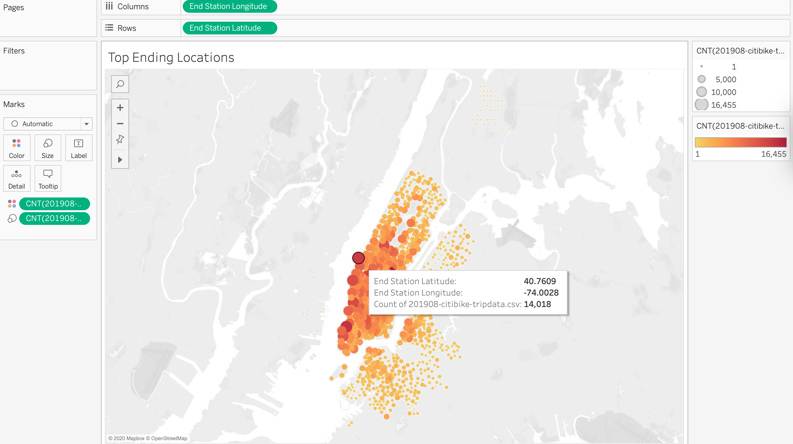

# bikesharing
## Overview of the Statistical Analysis:
In this project, we are analyzing the NYC bike-sharing program in order to convince investors that it is a good business to invest in. First, we downloaded the 201908-citibike-tripdata from the Citi Bike System Data page (https://www.citibikenyc.com/system-data). Then, we use Pandas to convert the “tripduration” column from an integer to a date time datatype, and export the DataFrame as a CSV file. Lastly, we use Tableau to create a set of visualizations:
Checkout times for users
Checkout times by gender
Trips by weekday for each hour
Trips by gender (weekday per hour)
User trips by gender by weekday
Also, we will include two more visualizations we analysis earlier:
August peak hours
Top ending locations
Please see link for the story we create in Tableau Public:
  [link to dashboard](https://public.tableau.com/profile/jiayi.chen5667#!/vizhome/NYCCitiBikeAnalysis_16030521416920/NYCCitiBikeAnalysis?publish=yes)

## Results:
Figure 1 is the checkout times for users. This figure is an detailed example for how long bikes are checked out for all users. As Figure 1 shown, the least checkout time is around 22:00 to 00:00, the most number of bikes checking out perks at 03:00 to 06:00, and from 07:00 it slows down.
  
  Figure 1: Checkout times for users
  Figure 2 is the checkout times by gender. We graph the length of time that bikes are checked out for male, female and unknown gender. As Figure 2 shown, the most bikes are checked out by male, and unknown gender remains at the same level for checkout times. 
  
  Figure 2: Checkout times by gender
  Figure 3 is the trips by weekday for each hour. We use a heat map to present our visualization on the number of bike trips by weekday for each hour of the day. As Figure 3 shown, Monday and Tuesday around 17:00 to 18:00 has more trips, but the same time on Thursday has the most trips. 
  
  Figure 3: Trips by weekday for each hour
  Figure 4 is the trips by gender by weekday per hour. As the heat map shown, we believe this figure is aligned with the result from Figure 2. Male has more trips compare to female and unknown gender, and female has more trips than unknown gender. Also the male heat map is similar to Figure 4, which more trips occur from 17:00 to 18:00.
  
  Figure 4: Trips by gender (weekday per hour)
  Figure 5 is the user trips by gender by weekday. As shown in Figure 5, unknown gender has the least subscribers and male has the most subscribers. Yet, unknown gender customers has more trips than subscribers. On another hand, female has the least customer on weekday. 
  
  Figure 5: User trips by gender by weekday
  Figure 6 is the August peak hours. We use bar chart to better present the hours for bike trips during the month of August. As Figure 6 shown, the peak hour is 17:00, followed by 18:00. 08:00 is another popular hour for customers to start their bike trips. 
  
  Figure 6: August peak hours
  Figure 7 is the top ending locations. This map shows us the popular places for customers to drop off their bikes. We could say the most popular places to end the bike ride is concentrated, also it is almost the same places for customers to start their bike journey (please check out the link for Top Starting Locations).
  
  Figure 7: Top ending locations

## Summary:
In conclusion, we would say that male customers are the target for our bike sharing program. We would suggest that finding the most popular sightseeing area, and busy financial district to start our bike sharing program in Des Monies. Also, the peak hours are in the morning before work, and in the evening after work. We can say that people would like to avoid sitting in the car or buses in traffic, and people might like biking to places to get some exercise. In the future, I would like to add on one visualization showing most popular places customers bike to and the route that they go by gender by age. In addition, it would be great to have a visualization focusing on the trip checkout length by age of different gender that would show which age group favors biking in different time.